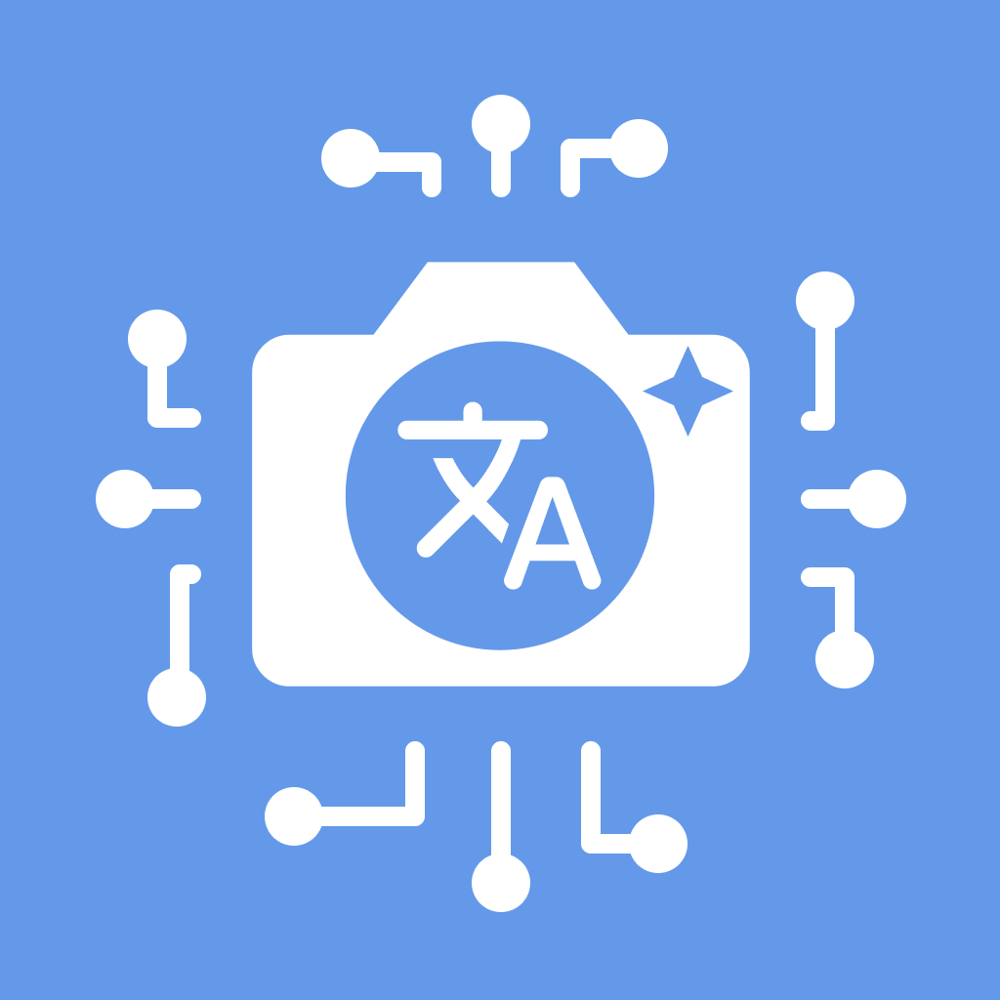
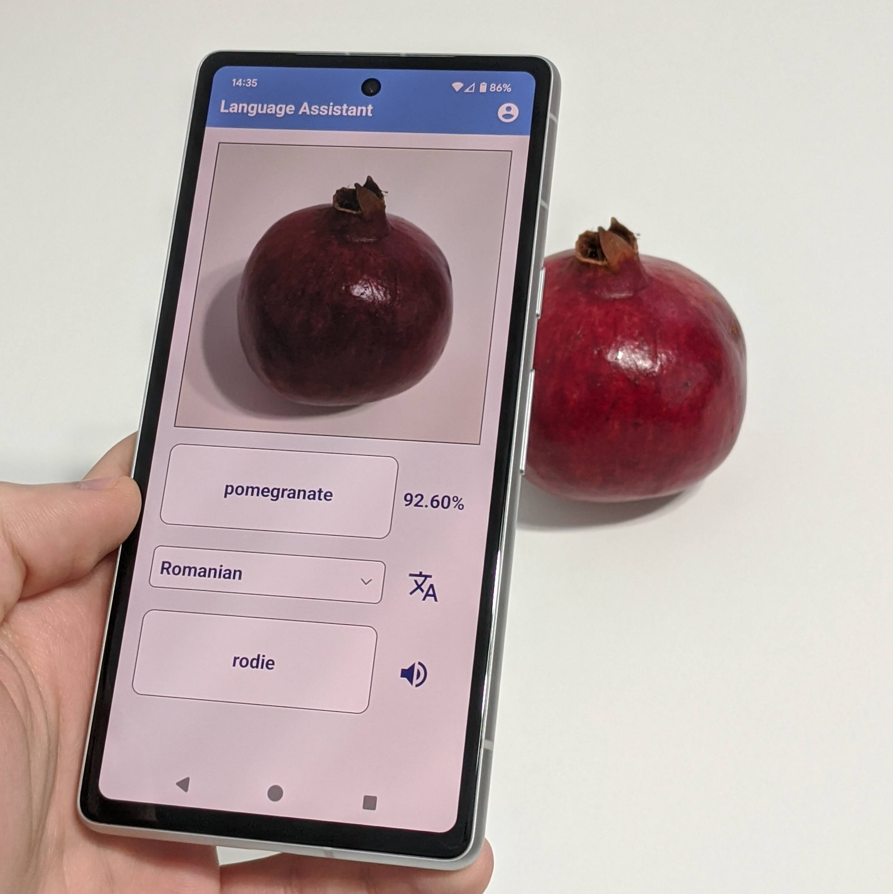

# Language Assistant

### Learn new languages with AI!
- Detect objects in your photos
- Translate to any language
- Listen to the result
- Keep history
- Level up!

|  |  | <a href="https://docs.google.com/presentation/d/1QBmnjBgvB85LjTHLeM4XnskQvkOjq6FVtV4fOmLFeIw/edit?usp=sharing">  |
| ----------- | ---------- | --------- |
| Get the app | Video demo | Slideshow |

### Team A²:
- Andrei JOLDEA &nbsp;&nbsp; &nbsp;&nbsp; — &nbsp;&nbsp; andrei.joldea@student.upt.ro  
- Andrei LAZAROV &nbsp;&nbsp; — &nbsp;&nbsp; andrei.lazarov@student.upt.ro

